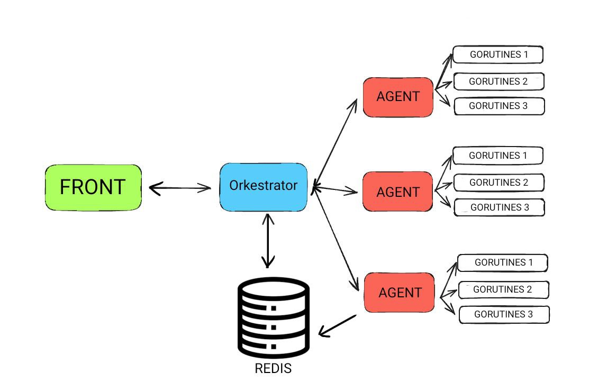
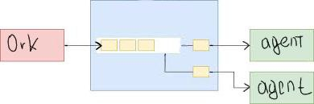

Полурабочий калькулятор
==============


***Содержание:***
- [Описание](#Introduction)
- [Работа сервиса](#Preparing)
- [Как собрать проект](#assembly)
- [Публикация новости о релизе в Telegram-канале DevOpsHQ](#News)
- [Проверка тестового проекта](#Testing)


# Описание <a name="Introduction"></a>

**Суть** — Пользователь вводит выражение на выход получает ответ через какой-то промежуток времени.Во время выполнения может следить за статусом воркеров и сам задавать время выполнения оперий. 
# Работа сервиса<a name="Preparing"></a>
Устройство :


Оркестратор получает выражение,после парсит его и начинает раскладывать на под выражения  и отправляет их  в очередь



# Как собрать проект <a name="assembly"></a>

1. В проекте присутствует Docker-compose с его помошью с можно собрать проект,скачав и открыв Docker, в терминале прописать docker-compose up

2. Запускаем localhost:8041


```
MIT License
 


